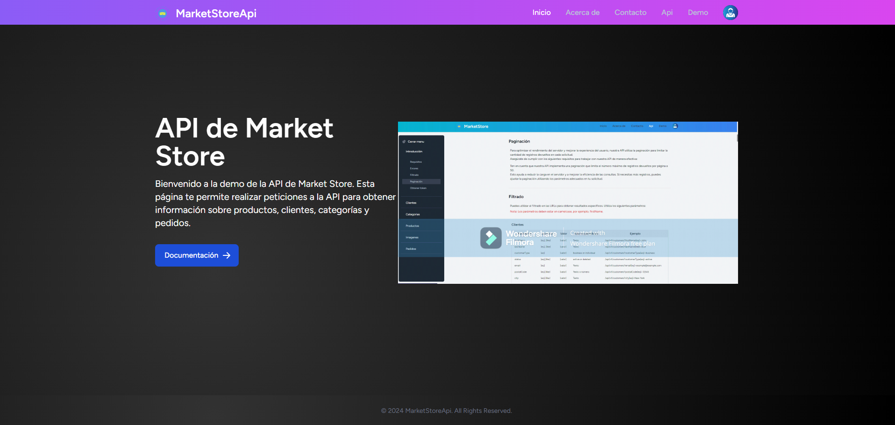

# API de Market Store

Market Store API es una API desarrollada utilizando Laravel 10, un potente framework de PHP para construir aplicaciones web y APIs de manera rápida y eficiente. 
Esta API proporciona funcionalidades para gestionar productos, clientes, categorías y pedidos para una tienda en línea.



## Características Principales

- Gestión de Productos: Permite operaciones CRUD (Crear, Leer, Actualizar, Eliminar) en productos.
- Gestión de Clientes: Proporciona endpoints para gestionar clientes, como crear, actualizar y eliminar clientes.
- Gestión de Categorías: Permite la administración de categorías de productos, como crear, actualizar y eliminar categorías.
- Gestión de Pedidos: Proporciona funcionalidades para gestionar pedidos, incluyendo la capacidad de crear nuevos pedidos, actualizar su estado y eliminarlos.

## Requisitos

- PHP 8.0 o superior
- Composer
- MySQL 5.7 o superior
- Breeze (para autenticación)
- Tailwind CSS (para estilos)
- Vite (para la construcción del frontend)

## Instalación

1. Clona este repositorio en tu máquina local.
2. Ejecuta `composer install` para instalar las dependencias de Laravel.
3. Copia el archivo `.env.example` y renómbralo a `.env`.
4. Configura las variables de entorno en el archivo `.env`, incluyendo la configuración de la base de datos.
5. Ejecuta `php artisan key:generate` para generar la clave de la aplicación.
6. Ejecuta `php artisan migrate --seed` para crear y poblar las tablas de la base de datos.
7. Instala Breeze utilizando el siguiente comando:


8. Configura Tailwind CSS y Vite según las necesidades de tu proyecto.

## Uso

````bash

npm run dev
php artisan serve

````

Una vez instalada y configurada la API, puedes empezar a usarla a través de las rutas y endpoints proporcionados. Aquí tienes algunos ejemplos de cómo interactuar con la API:

- Obtener la lista de todos los productos: `GET /api/v1/products`
- Crear un nuevo producto: `POST /api/v1/products`
- Actualizar un producto existente: `PUT /api/v1/products/{id}`
- Eliminar un producto: `DELETE /api/v1/products/{id}`

Para obtener una lista completa de todas las rutas y endpoints disponibles, consulta la documentación de la API.

### Documentación


### Postman 

<a href="https://documenter.getpostman.com/view/18820606/2sA3Bt19WM">Colección de postman</a>


## Contribuciones

¡Si deseas contribuir a este proyecto, siéntete libre de hacerlo! Solo sigue estos pasos:

1. Haz un fork del repositorio.
2. Crea una nueva rama (`git checkout -b feature/nueva-caracteristica`).
3. Realiza tus cambios y haz commit (`git commit -am 'Agregar nueva característica'`).
4. Sube tu rama (`git push origin feature/nueva-caracteristica`).
5. Abre un Pull Request.

## Créditos

Este proyecto fue desarrollado por Tarek Zemmari.


## DEMO


## Licencia

Este proyecto solo es para uso educativo no es para uso comercial.


